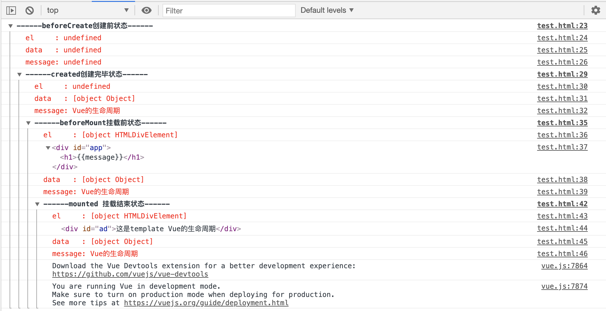
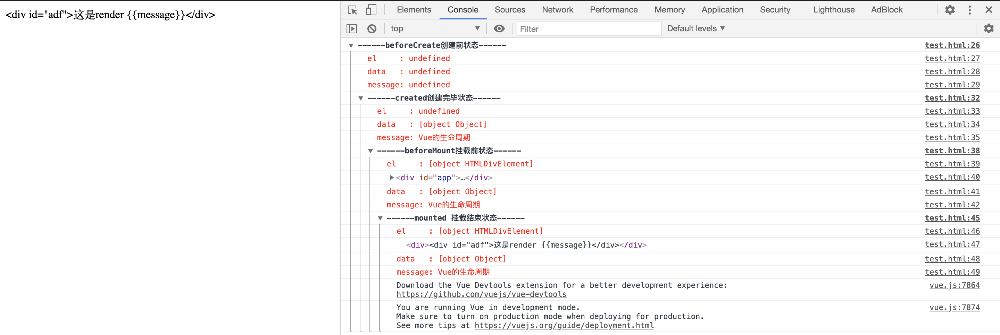

[toc]

# 生命周期


上面是vue官网生命周期的图。结合下方代码：

```html
<!DOCTYPE html>
<html lang="en">
<head>
  <script src="https://cdn.bootcss.com/vue/2.4.2/vue.js"></script>
</head>
<body>
  <div id="app">
    <h1>{{message}}</h1>
  </div>
</body>
<script>
  var vm = new Vue({
    el: '#app',
    data: {
      message: 'Vue的生命周期'
    },
    beforeCreate: function() {
      console.group('------beforeCreate创建前状态------');
      console.log("%c%s", "color:red" , "el     : " + this.$el); //undefined
      console.log("%c%s", "color:red","data   : " + this.$data); //undefined 
      console.log("%c%s", "color:red","message: " + this.message) 
    },
    created: function() {
      console.group('------created创建完毕状态------');
      console.log("%c%s", "color:red","el     : " + this.$el); //undefined
      console.log("%c%s", "color:red","data   : " + this.$data); //已被初始化 
      console.log("%c%s", "color:red","message: " + this.message); //已被初始化
    },
    beforeMount: function() {
      console.group('------beforeMount挂载前状态------');
      console.log("%c%s", "color:red","el     : " + (this.$el)); //已被初始化
      console.log(this.$el);
      console.log("%c%s", "color:red","data   : " + this.$data); //已被初始化  
      console.log("%c%s", "color:red","message: " + this.message); //已被初始化  
    },
    mounted: function() {
      console.group('------mounted 挂载结束状态------');
      console.log("%c%s", "color:red","el     : " + this.$el); //已被初始化
      console.log(this.$el);    
      console.log("%c%s", "color:red","data   : " + this.$data); //已被初始化
      console.log("%c%s", "color:red","message: " + this.message); //已被初始化 
    },
    beforeUpdate: function () {
      console.group('beforeUpdate 更新前状态===============》');
      console.log("%c%s", "color:red","el     : " + this.$el);
      console.log(this.$el);   
      console.log("%c%s", "color:red","data   : " + this.$data); 
      console.log("%c%s", "color:red","message: " + this.message); 
    },
    updated: function () {
      console.group('updated 更新完成状态===============》');
      console.log("%c%s", "color:red","el     : " + this.$el);
      console.log(this.$el); 
      console.log("%c%s", "color:red","data   : " + this.$data); 
      console.log("%c%s", "color:red","message: " + this.message); 
    },
    beforeDestroy: function () {
      console.group('beforeDestroy 销毁前状态===============》');
      console.log("%c%s", "color:red","el     : " + this.$el);
      console.log(this.$el);    
      console.log("%c%s", "color:red","data   : " + this.$data); 
      console.log("%c%s", "color:red","message: " + this.message); 
    },
    destroyed: function () {
      console.group('destroyed 销毁完成状态===============》');
      console.log("%c%s", "color:red","el     : " + this.$el);
      console.log(this.$el);  
      console.log("%c%s", "color:red","data   : " + this.$data); 
      console.log("%c%s", "color:red","message: " + this.message)
    }
  })
</script>
</html>
```

运行结果：



从中可以知道，生命周期各个阶段做了什么事情：

## new vue

构造函数初始化vue实例。

## beforeCreate

初始化了事件和生命周期，即初始化了钩子函数。

## created

属性绑定，data属性绑定数据。DOM未生成，el未挂载。即data初始化完成，el未完成。

## beforeMount

在created和beforeMount之间要做很多事情，先判断是否有el，如果没有，则不继续下去，一直等到$mount(el)调用，绑定了el才继续。如果存在el，则继续判断是否存在template模版，如果存在则编译template模版到render函数中，如果不存在，则把el外部的dom作为template。

在vue对象中还有一个**render函数**，它是以createElement作为参数，然后做渲染操作，而且我们可以直接嵌入JSX.

如果我们 render、template、el都存在，如下代码：

```js
var vm = new Vue({
    el: '#app',
    data: {
      message: 'Vue的生命周期'
    },
    template: '<div id="ad">这是template {{message}}</div>',
    render(createElement){
      return createElement('div','<div id="adf">这是render {{message}}</div>');
    },
//上面是部分vue代码
```

则渲染出来的是render中的代码：



所以综合排名优先级：
render函数选项 > template选项 > outer HTML.

在beforeMounted和mounted之间，完成了el的初始化。但没有挂载到页面上，在js中依旧是虚拟dom。

## mounted

mounted后，完成挂在，完成所有值的渲染。

## beforeUpdate

在data改变后，触发beforeUpdate和updated钩子函数。beforeUpdate和updated中，完成虚拟dom的重新渲染。

## updated

虚拟dom重新渲染到页面上。

## beforeDestroy

当调用了$destory()，则进入beforeDestroy钩子函数。在beforeDestroy和destroyed中，主要完成监听器、事件、部件等的销毁。实例仍然存在。

## destroyed

完成销毁，实例不存在。